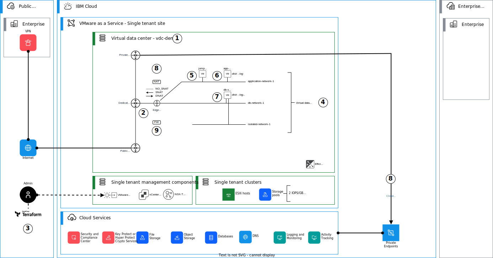

# VCF as a Service - Terraform Examples

VCF as a Service in IBM Cloud® is a managed VMware service which delivers VMware Cloud Director platform running on dedicated IBM Cloud® Bare Metal Servers. This repository includes terraform examples for deploying various examples for VCF as a Service - single or multi-tenant instances.

## Getting API end points and virtual data center details

Use the [IBM Cloud Console](http://cloud.ibm.com/vmware) to create your VCF as a Service - a multi-tenant virtual data center or a single tenant instance and create one or more virtual data centers on it. Once deployed, you can collect the API details and virtual data center IDs from the Console, or you can alternatively use the attached `vmwaas.sh` shell script. It will collect these values using VCF as a Service API.

Configure your region and API key with:

```bash
export IBMCLOUD_API_KEY=your-api-key-here
export IBMCLOUD_REGION=region-here 
```

Note. The default region is `us-south`.

Script usage:

```bash
% ./vmwaas.sh
USAGE : vmwaas [ ins | in | vdcs | vdc | vdcgw | tf | tfvars ]
```


To list your instances:

```bash
% ./vmwaas.sh ins
Get instances.


Instances:

NAME          DIRECTOR_SITE_ID                      LOCATION    STATUS
demo          b75efs1c-35df-40b3-b569-1124be37687d  us-south-1  ReadyToUse
```


To list your virtual data centers:

```bash
% ./vmwaas.sh vdcs           
Get virtual datacenters.


VDCs:

NAME             ID                                    DIRECTOR_SITE_ID                      CRN
vdc-demo         5e37ed2d-54cc-4798-96cf-c363de922ab4  b75efs1c-35df-40b3-b569-1124be37687d  crn:v1:bluemix:public:vmware:us-south:...
```

To get terraform TF_VARs for authentication:

```bash
% ./vmwaas.sh tfvars vdc-demo
Get variables for terraform in export format.


TF_VARs:

export TF_VAR_vmwaas_url="https://<your_url>.us-south.vmware.cloud.ibm.com/api"
export TF_VAR_vmwaas_org="f37f3422-e6c4-427e-b277-9fec334b99fb"
export TF_VAR_vmwaas_vdc_name="vdc-demo"

```


Get your IP space name using the VMware Cloud Director Portal. Navigate to Networking > Edge Gateways. Check the Provider Gateway in the COnfiguration > General section. Note the GRP and VRF number in the name. E.g. `dal12-VRFGRPMS86-vrf18-GW` where ther GRP is `MS86`and VRF is `vrf18`. Navigate to Networking > IP Spaces. Find your IP space based on the name, e.g. `d12-MS86-V18-pub`. Set the name in a terraform variable `public_ip_space_name`.

```bash
export TF_VAR_public_ip_space_name = "put-your-ip-space-name-here"

```


## Virtual data center infrastructure automation example

This demo terraform deployment deploys an example infrastructure, which consists of two routed and one isolated virtual data center networks, three virtual machines and example source (SNAT) and destination (DNAT) network address translation and firewall rules. 

An overview of the deployment is shown below.



1. Use IBM Cloud Console to create a virtual data center in your single tenant instance. This example instance uses only 2 IOPS/GB storage pool.
2. When a virtual data center is created, an edge gateway and external networks are created automatically. External network provides you internet access and an IP address block of /29 with 8 usable public IP addresses is provided. This is provided through a Public IP space, whee each public IP is provided as a floating IP and is allocated through the Terraform.
3. Terraform template is used to create virtual data center networks, virtual machines as well as firewall and network address translation rules. The creation is fully controlled though variables. Terraform authenticates to VMware Cloud Director API with user name and password. Access tokens will be supported in the future.
4. Three virtual data center networks are created: two routed (application and db) and one isolated (isolated). Routed virtual data center networks are attached to the edge gateway while isolated virtual data center network is a standalone network. You can create more networks based on your needs.
5. A jump server is created with Windows 2022 Operating System. The server it attached to the application network. You can access the virtual machine though the VM console, or using RDP though the DNAT rule created on the Edge Gateway.
6. One example virtual machine (application-server-1) is created on the application network. Application server has an additional disk e.g. for logging. You can create more VMs or disks based on your needs.
7. One example virtual machine (db-server-1) is created on the db network. Database server has two additional disks e.g. for data and logging. You can create more VMs or disks based on your needs.
8. SNAT and DNAT rules are created for public network access. SNAT to public internet is configured for all routed networks and DNAT is configured to access the application server. NO_SNAT rules are created for traffic directed to IBM Cloud Service Endpoints.
9. Firewall rules are provisioned to secure network access to the environment. To create firewall rules, Static Groups and IP sets are created for networks and individual IP addresses.

For more details, see [terraform template instructions](./vdc_demo_infrastucture.md).