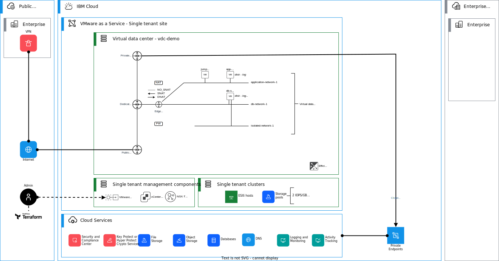

# Virtual data center infrastructure automation example

This demo terraform deployment deploys an example infrastructure, which consists of two routed and one isolated virtual data center networks, three virtual machines and example source (SNAT) and destination (DNAT) network address translation and firewall rules.

An overview of the deployment is shown below.



In this example, the creation is fully controlled though terraform variables - you do not need to change the actual terraform templates. An example `terraform.tfvars` file is provided below and example variable values are provided with explanations:

```terraform
# Note. Variable values to access your Director instance. Use the Director portal
# to figure our your values here.

vmwaas_url = "put-your-director-url-here" # for example "https://abcxyz.us-south.vmware.cloud.ibm.com/api"
vmwaas_org = "put-your-org-id-here"
vmwaas_vdc_name = "put-your-vdc-name-here"

vmwaas_user = "put-your-username-here"
vmwaas_password = "put-your-password-here"
#vmwaas_api_token = ""                                  # Note. This will be supported in the future.


# Note. Use a common name prefix for each item. 

item_name_prefix = "demo"

# Note. IBM Cloud DNS servers listed here. 
# You may also use your own here. 

dns_servers = ["161.26.1.10","161.26.1.11"] 


# Note. Create virtual data center networks of type `routed` or
# `isolated`. You can define one `static_ip_pool`and one
# `dhcp_ip_pool` for each.

vdc_networks = {
    application-network-1 = {
        description = "Application network 1"
        type = "routed"
        subnet = {
            cidr = "172.26.1.0/24"
            prefix_length = 24
            gateway = "172.26.1.1"
            static_ip_pool = {
                start_address = "172.26.1.10"
                end_address   = "172.26.1.100"
            }
            dhcp_ip_pool = {
                start_address = "172.26.1.101"
                end_address   = "172.26.1.199"
            }        
        }
    },
    db-network-1 = {
        description = "DB network 1"
        type = "routed"
        subnet = {
            cidr = "172.26.2.0/24"
            prefix_length = 24
            gateway = "172.26.2.1"
            static_ip_pool = {
                start_address = "172.26.2.10"
                end_address   = "172.26.2.100"
            }
            dhcp_ip_pool = {
                start_address = "172.26.2.101"
                end_address   = "172.26.2.199"
            }        
        }
    },
    isolated-network-1 = {
        description = "Isolated network 1"
        type = "isolated"
        subnet = {
            cidr = "172.26.3.0/24"
            prefix_length = 24
            gateway = "172.26.3.1"
            static_ip_pool = {
                start_address = "172.26.3.10"
                end_address   = "172.26.3.100"
            }
            dhcp_ip_pool = {} # leave empty for isolated network   
        }
    },
}


# Note. Create virtual machines inside your virtual data center.
# You can define each one idividually and attach multiple networks
# and disks. Individual disks are created for each additional disk.

# Note. Check the storage profile names and apply to your VMs / disks.
# If left empty, default profile is used.

#cpu_hot_add_enabled
#memory_hot_add_enabled


virtual_machines = {
    app-server-1 = {
        image = {
            catalog_name  = "Public Catalog"
            template_name = "RedHat-8-Template-Official"
        }
        memory          = 8192
        cpus            = 2
        cpu_hot_add_enabled = true
        memory_hot_add_enabled = true
        storage_profile = "2 IOPS/GB"
        networks = {
            0 = {
                name = "application-network-1"
                ip_allocation_mode = "POOL"
                is_primary = true
                ip = ""
            },
        }
        disks = {
            0 = {
                name = "logDisk"
                size_in_mb = "100"
                bus_type = "SCSI"
                bus_sub_type = "VirtualSCSI"
                bus_number = 1
                storage_profile = ""
            },
        }
    },
    db-server-1 = {
        image = {
            catalog_name  = "Public Catalog"
            template_name = "RedHat-8-Template-Official"
        }
        memory        = 8192
        cpus          = 2
        cpu_hot_add_enabled = true
        memory_hot_add_enabled = true
        storage_profile = ""
        networks = {
            0 = {
                name = "db-network-1"
                ip_allocation_mode = "POOL"
                is_primary = true
                ip = ""
            },
            1 = {
                name = "isolated-network-1"
                ip_allocation_mode = "POOL"
                is_primary = false
                ip = ""
            },
        }
        disks = {
            0 = {
                name = "dbDisk"
                size_in_mb = "100"
                bus_type = "SCSI"
                bus_sub_type = "VirtualSCSI"
                bus_number = 1
                storage_profile = ""
            },
            1 = {
                name = "dbLogDisk"
                size_in_mb = "100"
                bus_type = "SCSI"
                bus_sub_type = "VirtualSCSI"
                bus_number = 1
                storage_profile = ""
            },
        }    
    },
    jump-server-1 = {
        image = {
            catalog_name  = "Public Catalog"
            template_name = "Windows-2022-Template-Official"
        }
        memory        = 8192
        cpus          = 2
        cpu_hot_add_enabled = true
        memory_hot_add_enabled = true
        storage_profile = ""
        networks = {
            0 = {
                name = "application-network-1"
                ip_allocation_mode = "POOL"
                is_primary = true
                ip = ""
            },
        },
        disks = {}
    },
}


# Note. Map of available 6 public IPs. You can use these names
# in NAT rules.


public_ips = {
    0 = {
        name = "public-ip-0"
        description = "SNAT rule to application-network-1 and application-network-2"
    },
    1 = {
        name = "public-ip-1" 
        description = "DNAT rule to app-server-1"
    },
    2 = {
        name = "public-ip-2" 
        description = "DNAT rule to jump-server-1"
    },
    3 = {
        name = "public-ip-3" 
        description = ""
    },
    4 = {
        name = "public-ip-4" 
        description = ""
    },
    5 = {
        name = "public-ip-5" 
        description = ""
    },
}

# Note. You can use `vdc_networks` or `virtual_machines` keys as 
# address_targets here. Terraform will pick the IP address of 
# the specific resource and use that in the actual NAT rule.

# Note. You can specify the desired actual public IP address 
# (`external_address`) in the rule, or you can use the 
# `external_address_list_index`, which will pick the IP 
# addresss from the allocated IP pool (`edge_gateway_allocated_ips`). 

# Note. Use Director UI to get the name for the Application
# profiles."

nat_rules = {
    no-snat-to-ibm-cloud-166-9 = {
        rule_type   = "NO_SNAT"
        description = "NO_SNAT rule to application-network-1"
        external_address_target = ""
        external_address = ""  
        internal_address_target = "application-network-1"
        internal_address = ""
        snat_destination_address = "166.9.0.0/16"
        logging = false
        priority = 10
    },
    no-snat-to-ibm-cloud-161-26 = {
        rule_type   = "NO_SNAT"
        description = "NO_SNAT rule to application-network-1"
        external_address_target = ""
        external_address = ""  
        internal_address_target = "application-network-1"
        internal_address = ""
        snat_destination_address = "161.26.0.0/16"
        logging = false
        priority = 10
    },
    dnat-to-app-1 = {
        rule_type   = "DNAT"
        description = "DNAT rule to app-server-1"
        external_address_target = "public-ip-1"
        external_address = "" 
        internal_address_target = "app-server-1"
        internal_address = ""
        dnat_external_port = ""
        app_port_profile = ""
        logging = false
        priority = 90
    },
    dnat-to-jump-1 = {
        rule_type   = "DNAT"
        description = "DNAT rule to jump-server-1"
        external_address_target = "public-ip-2"
        external_address = "" 
        internal_address_target = "jump-server-1"
        internal_address = ""
        dnat_external_port = ""
        app_port_profile = ""
        logging = false
        priority = 90
    },
    snat-to-internet-1 = {
        rule_type = "SNAT"
        description = "SNAT rule to application-network-1"
        external_address_target = "public-ip-0"
        external_address = ""  
        internal_address_target = "application-network-1"
        internal_address = ""
        snat_destination_address = ""
        logging = false
        priority = 100
    },    
    snat-to-internet-2 = {
        rule_type = "SNAT"
        description = "SNAT rule to db-network-1"
        external_address_target = "public-ip-0"
        external_address = ""  
        internal_address_target = "db-network-1"
        internal_address = ""
        snat_destination_address = ""
        logging = false
        priority = 100
    },  
  }  

# Note. You can create IP sets to be used in firewall rules.

ip_sets = {
    on-premises-networks = {
      description = "On-premises networks"
      ip_addresses = ["172.16.0.0/16",]
    },
}


# Note. You can use `vdc_networks`, `nat_rules` (for DNAT) or
# `ip_sets` keys as sources or destinations here. Terraform 
# will pick the IP address of the specific resource and 
# use that in the actual rule.

# Note. Use "ALLOW or "DROP".

# Note. Use Director UI to get the name for the Application
# profiles."


firewall_rules = {
    app-1-egress = {
        action  = "ALLOW"
        direction = "OUT"
        ip_protocol = "IPV4"
        destinations = []
        sources = ["application-network-1", "db-network-1"]
        system_app_ports = []
        logging = false
    },
    dnat-to-app-1-ingress = {
        action  = "ALLOW"
        direction = "IN"
        ip_protocol = "IPV4"
        destinations = ["dnat-to-app-1"]
        sources = []
        system_app_ports = ["SSH","HTTPS","ICMP ALL"]
        logging = false
    },
    dnat-to-jump-1-ingress = {
        action  = "ALLOW"
        direction = "IN"
        ip_protocol = "IPV4"
        destinations = ["dnat-to-jump-1"]
        sources = []
        system_app_ports = ["RDP"]
        logging = false
    },
}

``` 